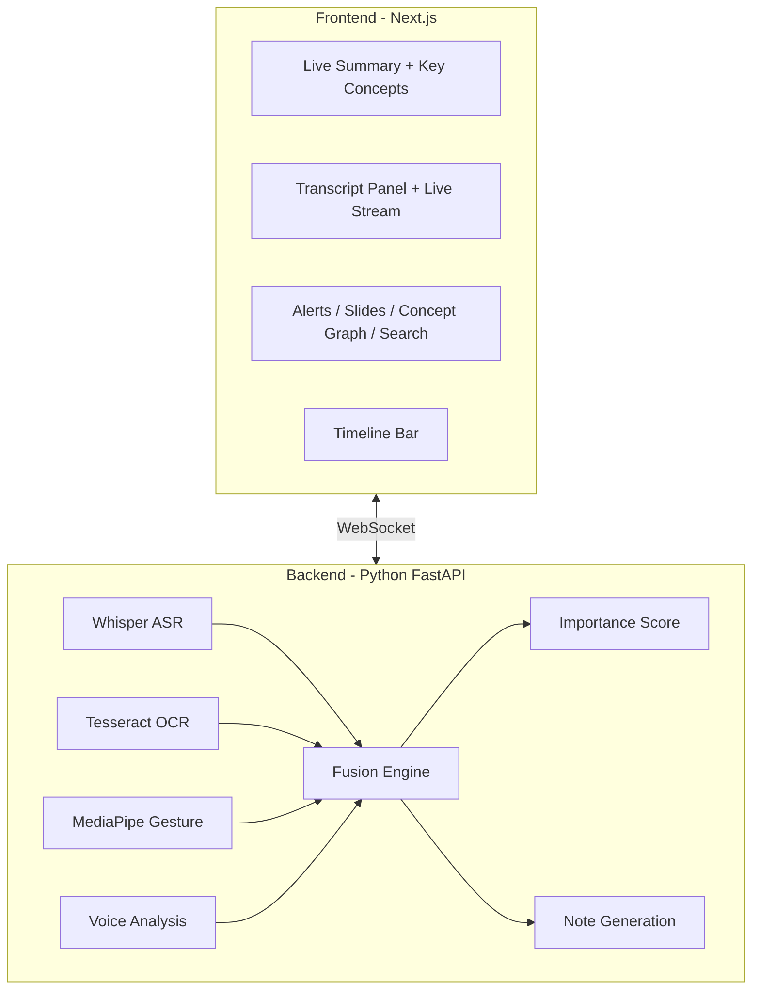

# NoteFlow AI - Live Lecture Automatic Note-Taker

A real-time, multi-modal lecture note-taking system that captures audio, video, and slide content to generate structured, importance-ranked notes powered by AI.

## Architecture



## Quick Start

### 1. Start the Backend (Demo Mode)

```bash
cd backend
pip install -r requirements.txt
python main.py
```

Backend runs on `http://localhost:8000`. 
- **Demo mode**: Simulates a Machine Learning lecture.
- **YouTube mode**: Processes any YouTube lecture URL in real-time.
- **Live mode**: Uses your system's mic and camera.

### 2. Start the Frontend

```bash
cd frontend
npm install
npm run dev
```

Frontend runs on `http://localhost:3000`.

### 3. Use the App

1. Open `http://localhost:3000`
2. **Standard Demo**: Click **Run Static Demo** to see a pre-recorded ML lecture simulation.
3. **YouTube Demo**: Paste a YouTube URL (e.g., a CS50 lecture) and click **Start YouTube Demo** to process it live.
4. **Live Lecture**: Enter a title and click **Start Live Lecture** to use your own hardware.
3. Watch as:
   - Live transcription streams in the center panel
   - Key concepts appear with importance indicators (Critical, Important)
   - The timeline populates with importance markers
   - Smart alerts fire for high-importance moments
   - The live summary updates every 30 seconds
4. Use the **Search** panel to find specific topics
5. Switch to **Slide** tab to see current slide content
6. Switch to **Graph** tab to see the concept knowledge graph
7. Click **Export** to download structured markdown notes

## Features

| Feature | Description |
|---------|-------------|
| YouTube Integration | Support for processing any YouTube lecture video |
| Live Transcription | Real-time speech-to-text with speaker diarization |
| Slide OCR | Automatic slide detection and text extraction |
| Gesture Detection | Professor gesture analysis for emphasis detection |
| Voice Analysis | Pitch, volume, and speech rate emphasis detection |
| Importance Scoring | Multi-modal fusion engine with weighted scoring |
| Key Concepts | Auto-detected concepts with definitions and quotes |
| Search | Full-text search across transcript and concepts |
| Concept Graph | Knowledge graph connecting lecture concepts |
| Timeline | Visual timeline with importance markers |
| Smart Alerts | Real-time notifications for high-importance moments |
| Export | Download structured markdown notes |

## Tech Stack

- **Frontend**: Next.js 15, TypeScript, CSS (custom design system)
- **Backend**: Python, FastAPI, WebSocket
- **AI Models**: OpenAI Whisper, MediaPipe, Tesseract OCR, librosa
- **Demo Mode**: Built-in simulator for testing without hardware
