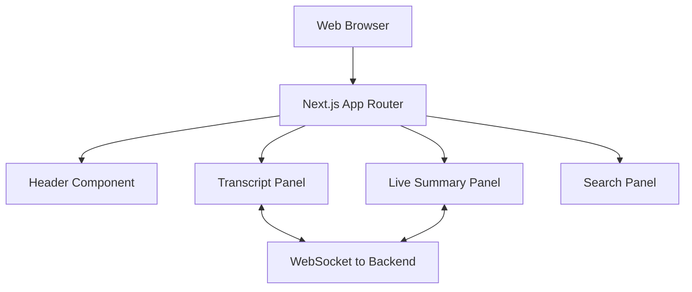

# NoteFlow AI - Frontend

Welcome to the frontend repository for NoteFlow AI, an advanced live lecture note-taking and presentation tracking system. This application provides a real-time, interactive user interface for students and professionals to capture, track, and search through live lecture content effectively.

## Architecture



## Features

- Live Lecture Tracking: Real-time synchronization with ongoing lectures or presentations.
- Dynamic Note Visualization: View extracted concepts and transcripts as they are generated.
- Smart Search: Instantly search through lecture transcripts and key concepts using the integrated search panel.
- Export Capabilities: Easily export your generated notes for later review.
- Modern UI/UX: A responsive, glassmorphism-inspired interface providing a sleek and distraction-free experience.

## Tech Stack

- Framework: Next.js (App Router)
- Library: React
- Language: TypeScript
- Styling: Custom CSS with modern design principles

## Getting Started

### Prerequisites

Ensure you have the following installed on your local machine:
- Node.js (v18 or higher)
- npm, yarn, pnpm, or bun

### Installation

1. Clone the repository and navigate to the frontend directory:
   ```bash
   cd frontend
   ```

2. Install the dependencies:
   ```bash
   npm install
   # or
   yarn install
   # or
   pnpm install
   # or
   bun install
   ```

### Running the Development Server

Start the development server with the following command:

```bash
npm run dev
# or
yarn dev
# or
pnpm dev
# or
bun dev
```

Open http://localhost:3000 with your browser to see the application in action. The page will automatically update as you modify the source files.

## Project Structure

- `app/`: Contains the main application routing, pages, and global layouts.
- `app/components/`: Reusable React components such as Header, SearchPanel, etc.
- `app/utils/`: Utility functions and formatters (e.g., time formatting).

## Contributing

Contributions, issues, and feature requests are welcome. Feel free to check the issues page if you want to contribute.

## License

This project is licensed under the MIT License.
